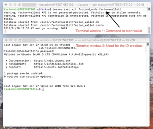
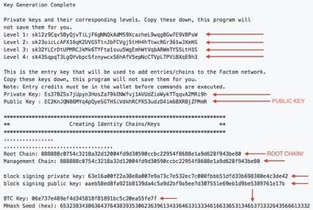

[TOC]

Downloading the latest factomd-version
------------------------------------

First we need to make a folder to host the files; we will name it factom
and put it in your /home-directory.

You can either do this via the graphical interface, or by using the terminal.
In terminal ensure you are in your home directory (/home/user/) and execute

    mkdir factom

Now move into that folder by executing

    cd factom

Execute

    git clone https://github.com/FactomProject/communitytestnet.git

The above command made a new directory. Move into it by executing

    cd communitytestnet

Start the docker containers
---------------------------

Run the following command:

    docker pull emyrk/factomd_testnet_community:latest

And then:

    docker-compose up -d

Adding a configuration file to the docker
-----------------------------------------

Run the following commands:

    cp factomd.conf.EXAMPLE factomd.conf

and:

    docker run --rm -v ${PWD}/factomd.conf:/source -v communitytestnet_factomd_volume:/destination busybox /bin/cp /source /destination/m2/factomd.conf

Start the Factom software (factomd)
-----------------------------------

By executing the following command the software is started, and your
node will join the factom network as a follower node:

    docker exec factomd_node bash /root/bin/start.sh

Run this command to ensure that factomd is running:

    docker exec factomd_node ps -aux | grep factomd

If you get a similar response as in the image below everything is OK, and
you may continue to the next step.

Opening the appropriate ports on your network
---------------------------------------------

The following ports needs to be forwarded to your physical/virtual server
running the authority server:

- 8110: Peer (other nodes) discovery port
- 8220: SSH access for Factom developers/testnet coordinator(s) (ability to
remotely control docker for debugging and restart-purposes)
- 8090: Your node control panel

The process for forwarding/opening the ports are different for each router/
system, and you should consult your router’s (or VPS’) documentation to figure out
how to achieve this.

Note: In most routers this is done by logging in to its control panel, navigating to «port forwarding» and
adding rules that forwards the appropriate ports to the internal IP of your server (External port 8110 ->
internal port 8110 -> local IP of server).

To test that the port forwarding was successful and that your ports are now
exposed to the internet, try the following commands

    nc PUBLIC_IP 8110 

(should yield text like «network version/type/lenght)

and

    nc PUBLIC_IP 8220

(should output SSH-2.0-OpenSSH(...))  
Note: To obtain your public IP just google «what is my IP».

Static IP-address requirement
-----------------------------

The Factom firewall rules require that Authority servers has a static IP, so if you
are applying for running an Authority node from home you will need to request to
get a static IP address from your internet service provider (ISP).  
Note: a «normal» IP address (dynamic) provided by an ISP often changes at set intervals, which would
make it unsuitable for the purpose of logging in remotely.

Creating a Factom blockchain ID
-------------------------------

To be able to join the test net as an authority server or an audit server you will
need a «personal» server identity. This is done by executing some special
commands that tells your factom node to generate a new ID.

**Important: After starting the node for the first time (start.sh) you should wait until 
it has fully synced with the rest of the net before you interact with the blockchain in the following steps.
Verify via control panel at :8090 ("Node sync status 1: 100%"). This could take hours.**

Generating the ID requires you to have two terminal windows open. One will be
used for hosting the factom wallet while the other is used for inputting the
appropriate commands

In the first window launch the Factom wallet:

    docker exec -it factomd_node factom-walletd

Then move along to the second terminal window.
All further commands will be executed from this window.

If you have been issued a Test Credit (TC) address, import it now:

    docker exec factomd_node factom-cli importaddress EsXXXXXXXX

If you already have a TC address, you may skip the following section.

------

## New Test Credit Address
If you don't have a Test Credit address yet, you have to generate a new one, fund it by using
the Faucet, confirm the funding and then continue installation.

Generate new TC address:

    docker exec factomd_node factom-cli newecaddress

Take note of your address, then visit the Factoid Faucet to fund your address, either under the
["Before you start"](Before_you_start/Faucet)-section or
[this direct link](https://faucet.factoid.org).

Before you continue, please verify that your address has been funded:

    docker exec factomd_node factom-cli balance EsXXXXXXXXXXXXXX

Do note that your wallet has to be fully synced before your credits will appear in your balance.
You can verify your sync status from the Control Panel.

-----

Run the following command to generate a new Testoid (TTS) address:

    docker exec factomd_node factom-cli newfctaddress

Export the addresses you generated in the previous steps:

    docker exec factomd_node factom-cli exportaddresses

Note: This will export the SECRET/PRIVATE addresses associated with the TC/TTS-addresses

Verify independently that your TC address has been funded by executing
docker exec factomd_node factom-cli balance ECXXXXXXXXXXXX  
Note: Use the public address. The amount of credits in the TC-account will be displayed.

Execute the following command to generate an ID, public/private keys:

    docker exec factomd_node serveridentity full elements EsXXXXXXXXXXXXXXXXXXXXXXXXXXXXXXX -n create -f

Note: The private TC address should be used.

Copy/write down the output from the previous command (take a mental note
of where the public key and Root chain information is presented).

The previous command also (by magic) created a script for publishing your
new ID to the blockchain. Run this script by executing the following commands:

    docker exec factomd_node chmod 766 /root/create.sh

and;

    docker exec factomd_node bash /root/create.sh

Verify that your ID is written to the testnet blockchain by executing:

    docker exec factomd_node factom-cli get allentries YOUR-ROOT-CHAIN

Example:

    docker exec factomd_node factom-cli get allentries 888888c0754c3218a32d12004fd9d30590ccbc22954f8688e1a9d628f943be80

Executing this command should yield an output containing:

«EntryHash/ExtID/content», while «missing chain head» indicates
that your ID failed to register in the blockchain.  
Note: if this commands fails, what a minute and then try again.

With your ID registered in the testnet blockchain you may now modify your
factom node to utilize this new identity by running this command:

    docker exec factomd_node bash -c "sed -i '/Node Identity Information/q' /root/.factom/m2/factomd.conf && grep Identity -A 2 create.conf >> /root/.factom/m2/factomd.conf"

The last step is to reboot your node; which will make it rejoin the testnet with
the correct identification:

    docker exec factomd_node bash /root/bin/stop.sh

and

    docker exec factomd_node bash /root/bin/start.sh

Informing Factom/community coordinator that you are ready to be promoted to audit/authority server
--------------------------------------------------------------------------------------------------

When all the steps above has been successfully executed, you are now ready
to be promoted to an audit or federated server. Note that your server should be
running continuously from this point forward, and any restarts/downtime should be
coordinated with Factom/testnet coordinator.
Note: If you restart your computer/server the docker containing the factom node/authority server will
automatically relaunch, and you should not be

To be promoted you need to fill out the following [form](https://docs.google.com/forms/d/e/1FAIpQLSczJm-U7P2AFh3nDikSrfgnUG3E4fjExNE7AH_RL3nDdHg9_g/viewform).
